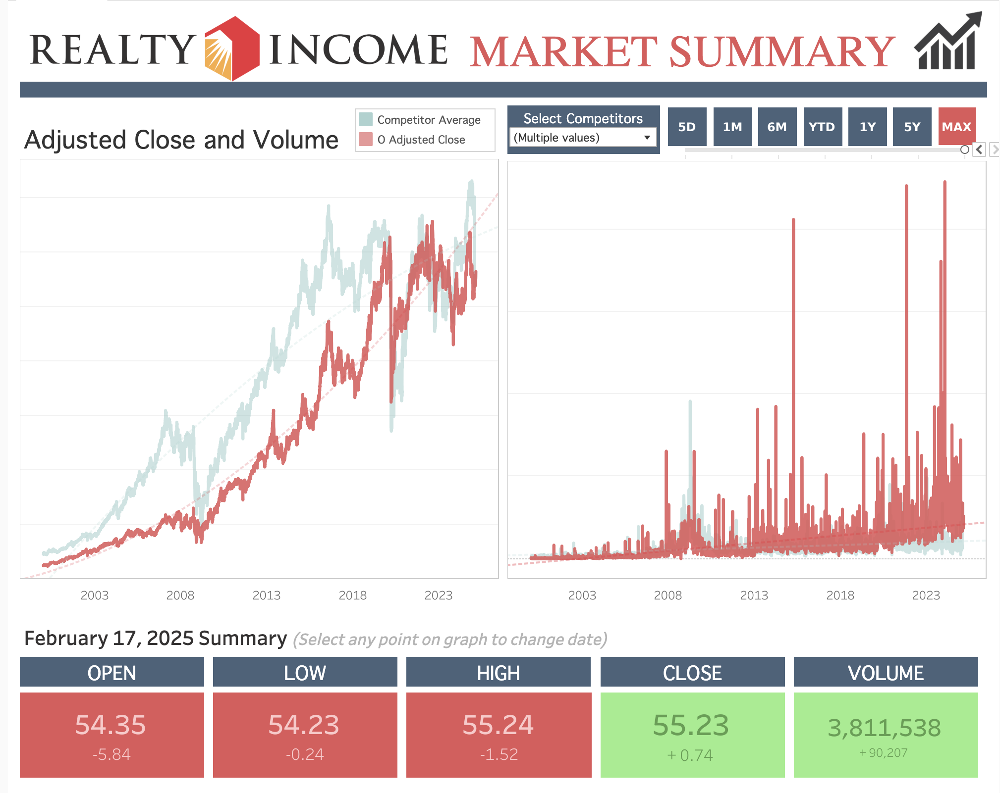
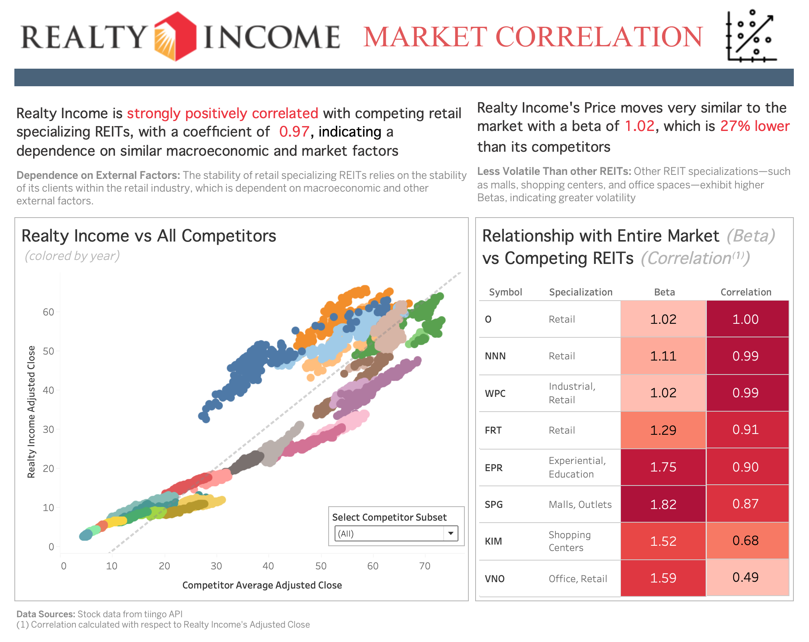
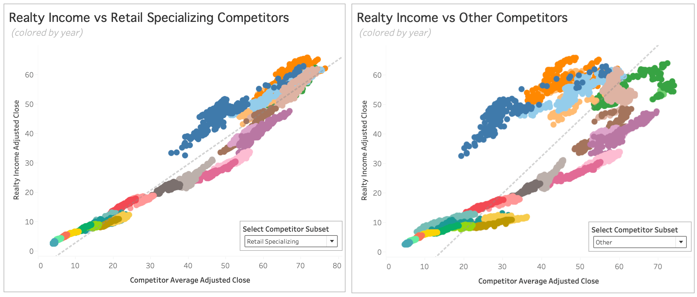

## Introduction <!-- omit in toc -->
Realty Income Corporation is an S&P 200 real estate investment trust (REIT) that specializes in investing in long-term, triple net leases with single tenant free standing commercial properties. For a publicly traded company aiming to break into the S&P 100, data analysis is essential for optimizing performance, growth, and stability. Leveraging data enables smarter business decisions and more strategic property acquisitions while also providing a clear framework for measuring success. Beyond these internal benefits, transparency and presentation of their data strengthens investor confidence, showcasing both Realty Income’s sustained growth and its ability to make the most informed decisions. 

This project features five interactive dashboards that an analyst at Realty Income might be responsible for developing. Additionally, the repository includes Python scripts for both static data collection as well as an automated data pipeline desinged to streamline data extraction, transformation, and loading (ETL), ensuring relevant, real-time data. 

Dashboards can be interacted with on my tableau public page: [conner.khudaverdyan](https://public.tableau.com/app/profile/conner.khudaverdyan/vizzes) *Due to limitations of Tableau Public, the dashboards published there will not present the most recent data*

## Table of Contents <!-- omit in toc -->
- [Data Overview](#data-overview)
  - [Data Sources](#data-sources)
  - [Data Model](#data-model)
- [Technical Overview](#technical-overview)
  - [Requirements](#requirements)
  - [Data Pipeline with Airflow and Excel for Real-Time Stock Dashboard](#data-pipeline-with-airflow-and-excel-for-real-time-stock-dashboard)
  - [Static Data Extraction for Report Dashboards](#static-data-extraction-for-report-dashboards)
- [Executive Summary](#executive-summary)
- [Dashboards and Analysis](#dashboards-and-analysis)
  - [Real-Time Interactive Market Summary](#real-time-interactive-market-summary)
    - [Macroeconomic Analysis, Speculation, and Timeline](#macroeconomic-analysis-speculation-and-timeline)
    - [Trajectory](#trajectory)
  - [Portfolio Composition Report](#portfolio-composition-report)
  - [Market Correlation Report](#market-correlation-report)
  - [Industry Expansion Report](#industry-expansion-report)
  - [Geographic Expansion Report](#geographic-expansion-report)
- [Caveats and Assumptions](#caveats-and-assumptions)

## Data Overview

### Data Sources

**1. Realty Income 2023 10-K form**
- retrievable through United States Securities and Commison (SEC) API or downloadable on their website: [realty_income_10K]('https://www.sec.gov/ix?doc=/Archives/edgar/data/726728/000072672824000047/o-20231231.htm')

**2. Europe Retail Turnover**
- available for download from [eurostat]('https://ec.europa.eu/eurostat/databrowser/view/sts_trtu_m__custom_15303481/default/table?lang=en')

**3. Industry Real Gross Output**
- available for bulk download from Burea of Economics: [bea.gov]('https://apps.bea.gov/iTable/?isuri=1&reqid=151&step=1')

**4. Realty Income Stock Data**
- available through tiingo API or excel stock feature

### Data Model 
In order to create all the visuals in one tableau workbook, every data source must have a relation. Here is a visual that outlines the data model: 

  
## Technical Overview

### Requirements
**Users**
- No requirements for end-user; to interact with dashboards, visit my Tableau Public account: [conner.khudaverdyan](https://public.tableau.com/app/profile/conner.khudaverdyan/vizzes)

**Developers**
1. Tableau Desktop 
2. Excel Desktop 
   - other data storage approaches work, but you will need to modify python scripts that were  made for working with excel files
3. Docker
   - Used to set up data pipeline with Apache Airflow 
   - Refer to `docker-compose.yaml` for details
   - Additional python dependencies are listed in `requirements.txt`, which is automatically built into `Dockerfile`
4. Python 
   - `get_10k_data.py` is separate from the airflow pipeline and thus is separate from Dockerfile and requirements.txt, so set up a separate virtual environment containing pandas, openpyxl, requests, and Beautiful Soup. 

*Note:* before setting up DAGS, modify `update_data_public.py` to include your own API key from tiingo

### Data Pipeline with Airflow and Excel for Real-Time Stock Dashboard
1. Overview
   1. Real-time data is extracted daily with tiingo API through `airflow` and `update_data_public.py`
   2. Data is appended to excel workbooks in `stock_data` directory (not included in github as per tiingo's terms and conditions)
   3. Data cleaning and processing is done in Excel and PowerQuery. Refer to `excel.documentation.txt` for details
   4. Data connection is then estabilished in Tableau Desktop, connecting to Stock Data
2. Set up
   1. Run `docker-compose up --build` in project directory
   2. Utilize indicated local webserver in browser (e.g. localhost:8080)
      - default User and Password are both airflow.  You can create custom users in docker-compose.yaml
   3. If paused, manually unpause the update_data DAG. If still not starting, manually trigger the DAG 
   4. to close webserver run `docker-compose down`

### Static Data Extraction for Report Dashboards

1.  `get_10k_data.py` extracts tables from  Realty Income's 2023 10-K form using Beautiful Soup then cleans and saves them to excel files
2.  In excel, further data wrangling is executed, refer to`excel.documentation.txt`  for details
3.  Data connection is then estabilished locally in Tableau 

## Executive Summary
Despite some volatility over the past five years, Realty Income Corporation has demonstrated substantial long-term growth since 2000 and is well-positioned to continue this trajectory. While the company's stock price tends to move in tandem with competing REITs (correlation of ~.90), Realty Income has shown greater resilience during economic downturns.

Realty Income continues to maintain focus on single-unit freestanding retail properties under long-term net lease agreements, **97%** of its portfolio being retail properties and **31%** of its leases having 10 or more years remaining. 

Home and Furniture has a emerged as an ideal candidate for industry diversification within Realty Income's portfolio, exhibiting near-zero correlation with its dominant industries.

Additionally, Türkiye presents a compelling expansion opportunity in Europe. The country has experienced a **677%** growth in retail turnover, signaling high potential for securing triple net leases from the large pool of retailers seeking to expand their businesses.

## Dashboards and Analysis

### Real-Time Interactive Market Summary

#### Description <!-- omit in toc -->
The Real-Time Interactive Market Summary dashboard provides key daily metrics for Realty Income’s (O) stock performance. The two primary graphs display trading volume and closing price trends over time, with a customizable time range slider (MAX, 5Y, 1Y, etc.). Realty Income’s stock price (red) is compared against an average of selected competing Real Estate Investment Trusts (REITs) (light blue), with competitor selection being a customizable parameter.

At the bottom, users can view open, low, high, close prices, and volume data, along with the daily changes for Realty Income. These values are associated with the a single date, which can be selected by clicking on a given data point. All of these metrics are adjusted to account for external factors that create noise around the intrinsic value of the stock, such as stock splits, dividends, or other corporate actions.

#### Macroeconomic Analysis, Speculation, and Timeline
Realty Income became a publicly traded company in 1994, with stock data in the dashboard starting from 2000. From 2000 to 2008, the stock showed a steady increase until the 2008–2009 Great Recession, which caused a short decline. Interestingly, Realty Income was less affected than some competitors, possibly because its portfolio primarily consists of commercial properties rather than residential real estate. However, the decline was still notable as a result of overall economic downturn and the businesses leasing Realty Income’s properties facing economic headwinds themselves.

After 2009, Realty Income recovered and quickly grew even larger than it the was before the recession. This growth was consistent until around May 22nd 2013, when Federal Reserve Chairman Ben Bernanke alluded that the Fed would be taking a step back from its bond-buying program ([Federal Reserve)](https://www.federalreserve.gov/newsevents/testimony/bernanke20130522a.htm?)). This announcement suggested a potential decline in the bond market, leading to higher interest rates. Interest rates are a concern for Realty income, as debt financing is critical to its ability to acquire properties and maintain rental income. Higher interest rates increase borrowing costs, reducing REIT profitability. Furthermore, as Treasury yields rise, REIT dividend yields become less attractive to investors seeking less risky alternatives.

The FED tapering ended in  2014, followed by Realty Income's recovery and increase in price of ~12 by January 2015. In the following months the price dipped again, possibly do to the [anticpation of the first federal rate hikes](https://www.federalreserve.gov/monetarypolicy/fomcminutes20151216.htm?) since 2006, which eventually happened in December 2015. However, this may have been an overeaction by investors since Realty Income price increased by ~16  from September 2015 to July 2016.

From February 2018 to February 2020, Realty income's price saw massive growth (increase of ~30), but when Covid hit in March 2020, it saw its largest dip (drop of ~25). Quarantine measures reduced in-store shopping, leading to temporary closures of many commercial tenants. Investors likely reacted negatively to Realty Income’s retail exposure, shifting capital toward sectors benefiting from e-commerce and digital services.

 Once quarantine restrictions loosened, Realty Income bounced back quickly, rising to its highest price of ~65 in summer of 2022. However from August 2022 to October 2023, the Federal reserve dramatically increased interest rates from near 0 to 5.5%, once again causing a dip for Realty Income ([Fed Funds Interest Rate dataset](https://tradingeconomics.com/united-states/interest-rate)). Since then, Realty Income's price saw another spike from October 2023 to October 2024 (increase of ~18).

 #### Trajectory
 When looking at the last 5 years, it seems like Realty Income is trending downward  or platueaing; however, taking a longer-term view (since 2000), there is a clear upward trajectory. In the dashboard above, a polynomial model with degree 2 has been fit to the stock data, and when filtering to MAX, the model detects a positive curve, indicating future growth despite the recent stagnancy. 
 
 That said, this projection should be interpreted cautiously, as model outcomes depend on parameter selection. The polynomial curve may change significantly with different degree settings, and the model does not incorporate other factors such as  macroeconomic features or other internal factors related to Realty Income. 
 
With the incease of online shopping and shifts toward online alternatives, there has been concern over Realty Income and its large stake in retail properties; however, it seems that as more years pass since covid, in person shopping is [making a comeback](https://nypost.com/2024/12/24/business/in-person-shopping-makes-a-comeback-amid-record-spending-holiday-season/?). Given this trend, combined with the company's historical resilience, stable dividend yield, and strategic asset management, Realty Income is well-positioned for continued long-term growth, even during economic downturns.

### Portfolio Composition Report

#### Description <!-- omit in toc -->
The Portfolio Composition Report serves as a key slide in a stakeholder or annual/quarterly presentation, reinforcing transparency and building trust with shareholders. It highlights Realty Income’s continued focus on single-unit freestanding retail properties secured under long-term net lease agreements, emphasizing the company’s strategic real estate strategy for financial stability and minimizing risk. 

### Market Correlation Report

#### Description <!-- omit in toc -->
The Market Correlation Report brings attention to the relationship between Realty Income, its competitors, and the market as a whole.  Understanding this connection is crucial for identifying how market dynamics, industry trends, and macroeconomic factors impact Realty Income's performance. This analysis also highlights the relevance of portfolio diversification, and hence the subsequent expansion reports.

The Realty Income vs. Competitors scatter plot visualizes the price relationships between Realty Income and competing REITs. At first glance, the pattern appears non-linear; however, upon closer inspection—with years color-coded—a clear linear relationship emerges within each yearly cluster. 

The visual also has a parameter that allows one to subset the competitors between Retail and Non-Retail Specializing REITs. Since the parameter can only be used in a workbook or on tableau public, here is a screenshot comparing both subsets:

Side by side, the scatter plots reveal a much stronger linear relationship between Realty Income and the retail-specializing REITs compared to the non-retail ones. Notably, the non-retail scatter plot begins to diverge around 2018, forming a hook where Realty Income's prices become higher than those of the non-retail competitors overall. This hook formation is not entirely alarming, since the year clusters still showcase a linear relationship, but it is still a significant displacement that suggests a divergence in market trends

### Industry Expansion Report

#### Description <!-- omit in toc -->
The Industry Expansion Report explores Home & Furniture as a potential sector for Realty Income’s portfolio diversification. This dashboard serves as a pitch to company leadership or stakeholders, providing empirical evidence and application of portfolio theory to motivate research and assessments of Home & Furniture retailers and properties. 

In the Real Gross Output Correlation Heatmap, the interesections of two industries represent the correlation of the differenced real gross output. That is, the correlation is describing the linear relationship between the changes in real gross output overtime. A coefficient of 1 indicates that there is a strong positive correlation; e.g. an increase in amusements real gross output means an increase for food services as well. Conversely. a coefficient close to 0 means there is no correlation; e.g. an increase in warehousing real gross output does not necessarily mean an increase for home and furniture 

### Geographic Expansion Report

#### Description <!-- omit in toc -->
The Geographic Expansion Report provides a summary of Realty Income’s current European portfolio while identifying Türkiye as a promising candidate for expansion. The dashboard highlights Türkiye’s rapid retail turnover growth in recent years, signaling a high-upside opportunity to secure triple net leases with retailers who want to expand but lack the capital to acquire new properties.

## Caveats and Assumptions
- At the time of this commit, Realty Income's 10-K 2024 form has not been released, so the main data source is the 2023 form.  Therefore, the insights from the 3 report dashboards are most relevant to January 2024 as opposed to 2025. Additionally, future 10-K forms will likely vary in contents, so `get_10k_data.py` will likely need to be customized to accurately scrape the data. This does not apply to the Market Summary dashboard which is connected to real-time data. 
- In the [Macroeconomic Analysis, Speculation, and Timeline](#macroeconomic-analysis-speculation-and-timeline) section, I utilized the stock board to identify significant fluctuations in Realty Income's stock price. After pinpointing key dips and spikes, I researched macroeconomic events occurring around those timeframes to generate possible narratives and relationships. To supplement my analysis I utilized basic financial concepts (such as the mathematical relationship between interest rates and bond market) and macroeconomic principles. Moreover, my speculations are simply the *"tip of the iceberg"* in explaining these stock price movements. A more comprehensive breakdown of the timeline would require access to richer data sources and collaboration with industry experts for deeper research.  
- High retail turnover growth serves as an initial indicator for potential expansion but is not a comprehensive metric for evaluating real estate opportunities. Further analysis of inflation, macroeconomic conditions, regulatory environment and market stability is necessary to provide context. Once these factors are assessed, tenant creditworthiness and risk evaluation should follow to ensure sustainable investment decisions. The same principle applies to real gross output, which also acts a signal that can lead to further research and deeper contextual analysis.
- The competitors in the Market Summary and Correlation are all REIT's specializing in commercial properties, chosen for either their similarities to Realty Income, or their dominance in the market. Due to limitations of the API I was using,  I only pooled 8 competitors, but in practice this analysis would ideally pool data from every REIT on the market. 
  
  

