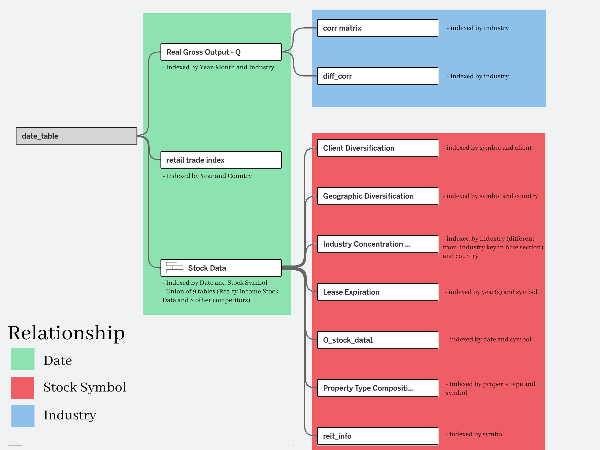
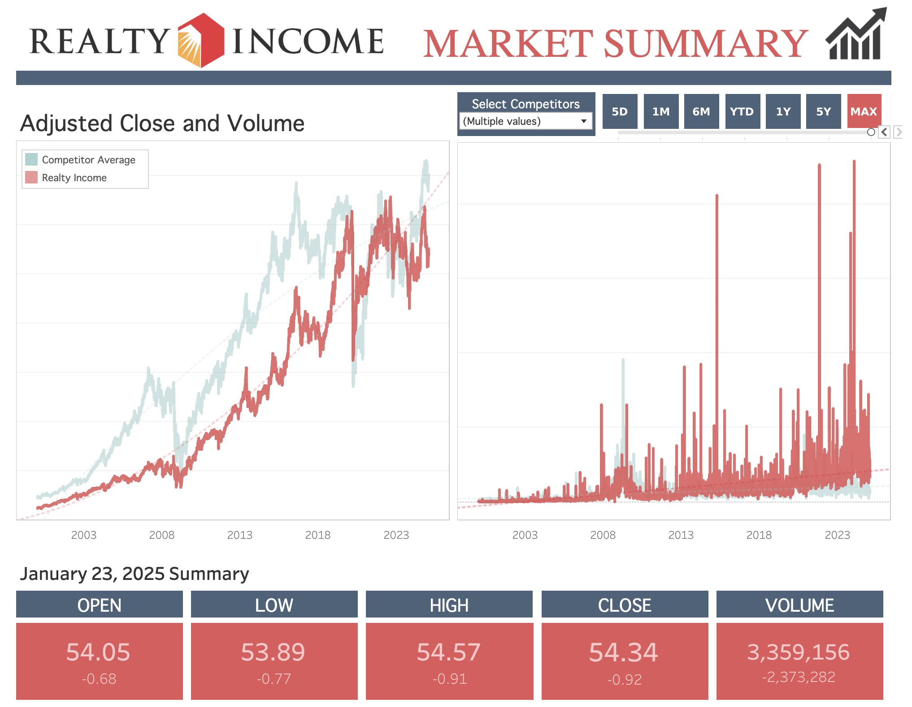
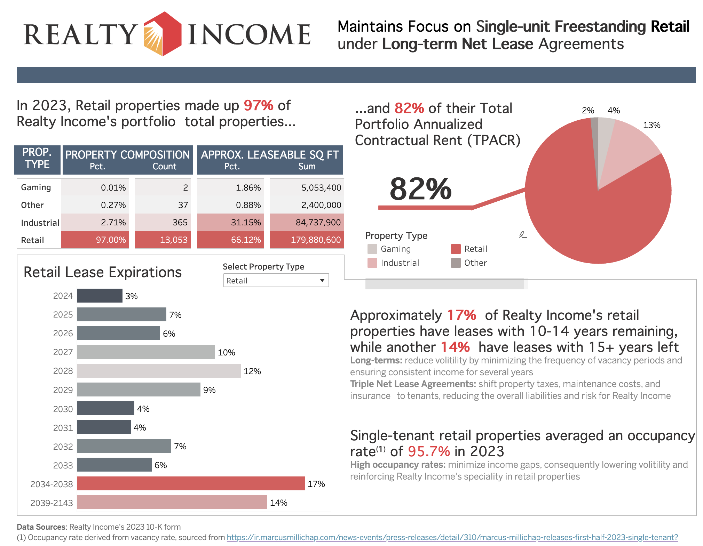
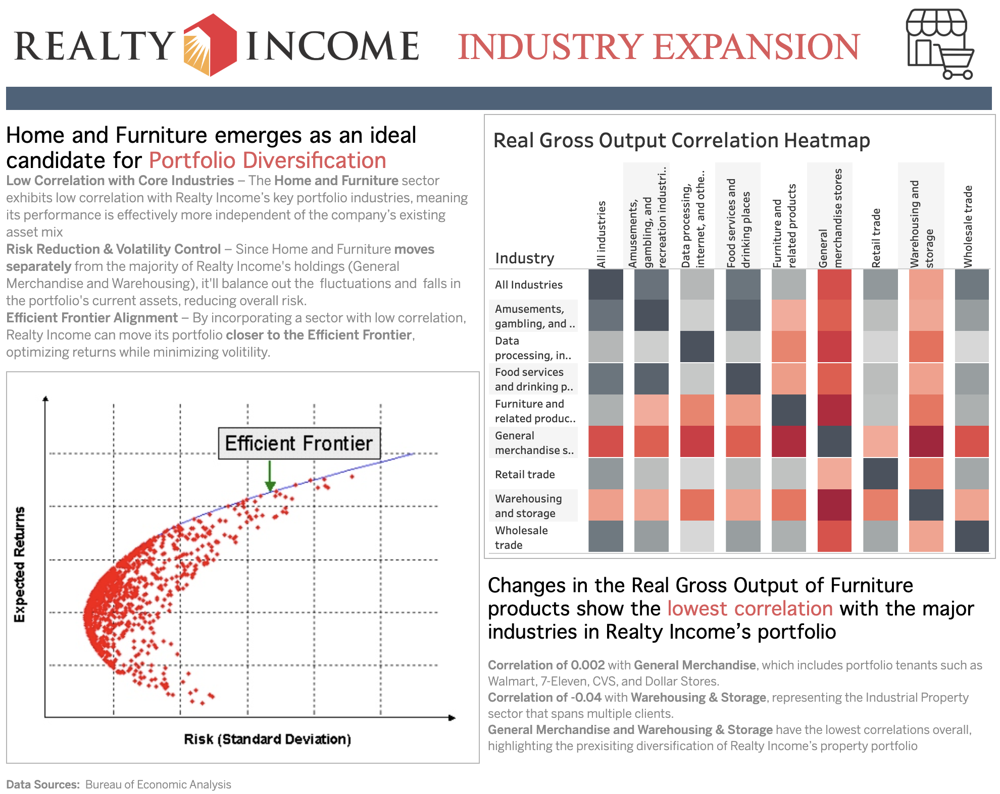
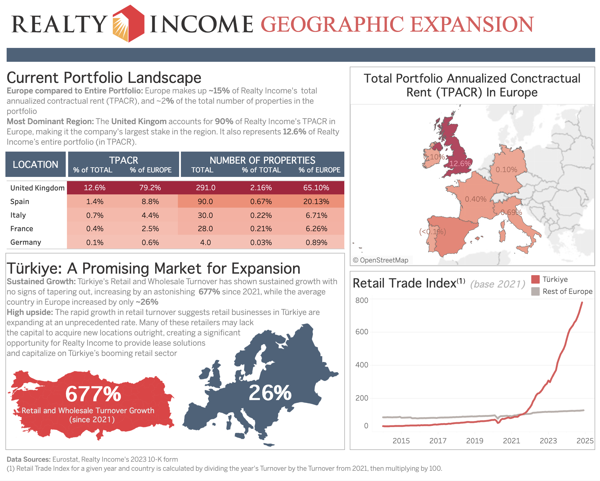

# Realty Income Business Analysis: Market Summary, Portfolio Composition, and Expansion 

## Introduction
Realty Income is an S&P 200 real estate investmenmt trust (REIT) that specializes in investing in long-term, triple net leases with single tenant free standing commercial properties. As a publicly traded company, maintaining investor confidence and a positive market outlook is crucial—hence its branding as "The Monthly Dividend Company."

This project presents four interactive dashboards that a business analyst at Realty Income might be responsible for developing. Additionally, I built an automated data pipeline in Python to streamline real-time data extraction, transformation, and loading (ETL), ensuring efficient and up-to-date insights.

Dashboards can be interacted with on my tableau public page: [conner.khudaverdyan]('https://public.tableau.com/app/profile/conner.khudaverdyan/vizzes')

## Table of Contents

- [Realty Income Business Analysis: Market Summary, Portfolio Composition, and Expansion](#realty-income-business-analysis-market-summary-portfolio-composition-and-expansion)
  - [Introduction](#introduction)
  - [Table of Contents](#table-of-contents)
  - [Data Overview](#data-overview)
    - [Data Sources](#data-sources)
    - [Data Model](#data-model)
  - [Technical Overview](#technical-overview)
    - [Requirements](#requirements)
    - [Data Pipeline with Airflow and Excel for Real-Time Stock Dashboard](#data-pipeline-with-airflow-and-excel-for-real-time-stock-dashboard)
    - [Static Data Extraction for Report Dashboards](#static-data-extraction-for-report-dashboards)
  - [Executive Summary](#executive-summary)
  - [Dashboards](#dashboards)
    - [Real-Time Interactive Market Summary](#real-time-interactive-market-summary)
    - [Portfolio Composition Report](#portfolio-composition-report)
    - [Industry Expansion Report](#industry-expansion-report)
    - [Geographic Expansion Report](#geographic-expansion-report)
  - [Caveats and Assumptions](#caveats-and-assumptions)

## Data Overview

### Data Sources

**Realty Income 2023 10-K form**
- retrievable through United States Securities and Commison (SEC) API or downloadable on their website: [realty_income_10K]('https://www.sec.gov/ix?doc=/Archives/edgar/data/726728/000072672824000047/o-20231231.htm')

**Europe Retail Turnover**
- available for download from [eurostat]('https://ec.europa.eu/eurostat/databrowser/view/sts_trtu_m__custom_15303481/default/table?lang=en')

**Industry Real Gross Output**
- available for bulk download from Burea of Economics: [bea.gov]('https://apps.bea.gov/iTable/?isuri=1&reqid=151&step=1')

**Realty Income Stock Data**
- available through tiingo API or excel stock feature

### Data Model 
In order to create all the visuals in one tableau workbook, every data source must have a relation. Here is a visual that outlines the data model: 

  
## Technical Overview

### Requirements
**Users**
- No requirements for end-user; to interact with dashboards, visit my Tableau Public account: [conner.khudaverdyan]('https://public.tableau.com/app/profile/conner.khudaverdyan/vizzes')

**Developers**
1. Tableau Desktop 
2. Excel Desktop 
   - other data storage approaches work, but you will need to modify python scripts that were  made for working with excel files
3. Docker
   - Used to set up data pipeline with Apache Airflow 
   - Refer to `docker-compose.yaml` for details
   - Additional python dependencies are listed in `requirements.txt`, which is automatically built into `Dockerfile`
4. Python 
   - `get_10k_data.py` is separate from the airflow pipeline and thus is separate from Dockerfile and requirements.txt, so set up a separate virtual environment containing pandas, openpyxl, requests, and Beautiful Soup. 

*Note:* before setting up DAGS, modify `update_data_public.py` to include your own API key from tiingo

### Data Pipeline with Airflow and Excel for Real-Time Stock Dashboard
1. Overview
   1. Real-time data is extracted daily with tiingo API through `airflow` and `update_data_public.py`
   2. Data is appended to excel workbooks in `stock_data` directory (not included in github as per tiingo's terms and conditions)
   3. Data cleaning and processing is done in Excel and PowerQuery. Refer to `excel.vba` for VBA code 
   4. Data connection is then estabilished in Tableau Desktop, connecting to Stock Data
2. Set up
   1. Run `docker-compose up --build` in project directory
   2. Utilize indicated local webserver in browser (e.g. localhost:8080)
      - default User and Password are both airflow.  You can create custom users in docker-compose.yaml
   3. If paused, manually unpause the update_data DAG. If still not starting, manually trigger the DAG 
   4. to close webserver run `docker-compose down`

### Static Data Extraction for Report Dashboards

1.  `get_10k_data.py` extracts tables from  Realty Income's 2023 10-K form using Beautiful Soup then cleans and saves them to excel files
2.  In excel, further data wrangling is executed, refer to `excel.vba` for details
3.  Data connection is then estabilished locally in Tableau 

## Executive Summary
Despite some volatility over the past five years, Realty Income Corporation has demonstrated substantial long-term growth since 2000 and is well-positioned to continue this trajectory. While the company's stock price tends to move in tandem with competing REITs, Realty Income has shown greater resilience during economic downturns

Realty Income continues to maintain focus on single-unit freestanding retail properties under long-term net lease agreements, 97% of its portfolio being retail properties and 31% of its leases having 10 or more years remaining. 

Home and Furniture has a emerged as an ideal candidate for industry diversification within Realty Income's portfolio, exhibiting near-zero correlation with its dominant industries.

Additionally, Türkiye presents a compelling expansion opportunity in Europe. The country has experienced a 677% growth in retail turnover, signaling high potential for securing triple net leases from the large pool of retailers seeking to expand their businesses.

## Dashboards

### Real-Time Interactive Market Summary

### Portfolio Composition Report

### Industry Expansion Report

### Geographic Expansion Report

## Caveats and Assumptions
- At the time of this commit, Realty Income's 10-K 2024 form has not been released, so the main data source is the 2024 form.  Therefore, the insights from the 3 report dashboards are most relevant to January 2024 as opposed to 2025. Additionally, future 10-K forms will likely vary in contents, so `get_10k_data.py` will likely need to be customized to accurately scrape the data. This does not apply to the Market Summary dashboard which is connected to real-time data. 

- High retail turnover growth serves as an initial indicator for potential expansion but is not a comprehensive metric for evaluating real estate opportunities. Further analysis of inflation, macroeconomic conditions, and market stability is necessary to provide context. Once these factors are assessed, tenant creditworthiness and risk evaluation should follow to ensure sustainable investment decisions. The same principle applies to real gross output, which also acts a signal that can lead to further research and deeper contextual analysis.
  

