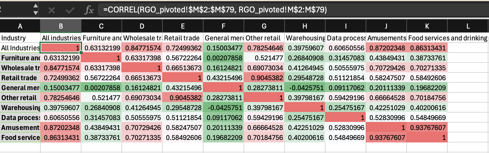

# Excel Documentation
Most of the transformations done in Excel were with formulas and PowerQuery, which do not have direct forms of documenation, so I opted to compile some of the notable excerpts of formulas, methods, and PowerQuery M code into this markdown file. 

## Excel Formulas 

#### Correlation Matrix


Algorythmically create correlation matrix with following formula:
```
=CORREL(RGO_pivoted!$M$2:$M$79, RGO_pivoted!M$2:M$79)
```
Where `RGO_pivoted` is pivoted Real Gross Output Table, `$M$2:$M$79` refers to the Real Gross Output of the first industry, and `CORREL(RGO_pivoted!$M$2:$M$79, RGO_pivoted!M$2:M$79)` is the correlation of that industry with itself (which is 1). When expanding the formula to the right, the lefthand side stays fixed, but for the righthand side of the formula, the column reference increments by 1, becoming `N$2:N$79`. So now, the formula for the cell next to the first cell is `CORREL(RGO_pivoted!$M$2:$M$79, RGO_pivoted!N$2:N$79)`, which represents the correlation between the original first industry with the second industry. 

Because of the absolute coding with '$', the relative positioning needs to be mannually incremented by one letter every row, and re typed in the next cell along the diagnol. 


## PowerQuery (M Code) Excerpts

#### Using PowerQuery to Access Lagged Stock Data
```
let
  Source = Excel.Workbook(File.Contents("realty_income.xlsx"), null, true),
  #"Navigation 1" = Source{[Item = "O_stock_data", Kind = "Sheet"]}[Data],
  #"Promoted headers" = Table.PromoteHeaders(#"Navigation 1", [PromoteAllScalars = true]),
  #"Changed column type" = Table.TransformColumnTypes(#"Promoted headers", {{"date", type datetime}, {"close", type number}, {"high", type number}, {"low", type number}, {"open", type number}, {"volume", Int64.Type}, {"adjClose", type number}, {"adjHigh", type number}, {"adjLow", type number}, {"adjOpen", type number}, {"adjVolume", Int64.Type}, {"divCash", type number}, {"splitFactor", Int64.Type}}),
  #"Sorted rows" = Table.Sort(#"Changed column type", {{"date", Order.Ascending}}),
  #"Added custom" = Table.TransformColumnTypes(Table.AddColumn(#"Sorted rows", "symbol", each "O"), {{"symbol", type text}}),
  #"Added index" = Table.AddIndexColumn(#"Added custom", "Index", 1, 1, Int64.Type),
  #"Merged queries" = Table.NestedJoin(#"Added index", {"Index"}, #"O_stock_data (2)", {"Index"}, "O_stock_data (2)", JoinKind.LeftOuter),
  #"Renamed columns" = Table.RenameColumns(#"Merged queries", {{"O_stock_data (2)", "lagged_tables"}}),
  #"Expanded lagged_tables" = Table.ExpandTableColumn(#"Renamed columns", "lagged_tables", {"adjClose", "adjHigh", "adjLow", "adjOpen", "adjVolume", "Index"}, {"adjClose.1", "adjHigh.1", "adjLow.1", "adjOpen.1", "adjVolume.1", "Index.1"}),
  #"Renamed columns 1" = Table.RenameColumns(#"Expanded lagged_tables", {{"adjClose.1", "adjClose_lag"}, {"adjHigh.1", "adjHigh_lag"}, {"adjLow.1", "adjLow_lag"}, {"adjOpen.1", "adjOpen_lag"}, {"adjVolume.1", "adjVolume_lag"}})
in
  #"Renamed columns 1"
```
#### Flattening Top Ten Industry Concentrations Table 
```
let
  Source = Excel.Workbook(File.Contents("realty_income.xlsx"), null, true),
  #"Navigation 1" = Source{[Item = "Top 10 Industry Concentrations", Kind = "Sheet"]}[Data],
  #"Changed column type" = Table.TransformColumnTypes(#"Navigation 1", {{"Column1", type text}, {"Column2", type number}, {"Column3", type number}, {"Column4", type text}, {"Column5", type text}, {"Column6", type text}}),
  #"Promoted headers" = Table.PromoteHeaders(#"Changed column type", [PromoteAllScalars = true]),
  #"Changed column type 1" = Table.TransformColumnTypes(#"Promoted headers", {{"2023", type number}}),
  #"Unpivoted columns" = Table.UnpivotOtherColumns(#"Changed column type 1", {"Industry"}, "Attribute", "Value"),
  #"Changed column type 2" = Table.TransformColumnTypes(#"Unpivoted columns", {{"Value", type number}}),
  #"Renamed columns" = Table.RenameColumns(#"Changed column type 2", {{"Attribute", "Year"}}),
  #"Added custom" = Table.TransformColumnTypes(Table.AddColumn(#"Renamed columns", "Symbol", each "O"), {{"Symbol", type text}})
in
  #"Added custom"
```

#### Cleaning and Formatting Real Gross Output table 
```
 let
  Source = Excel.Workbook(File.Contents("GrossOutput.xlsx"), null, true),
  #"Navigation 1" = Source{[Item = "Real Gross Output - Q", Kind = "Sheet"]}[Data],
  #"Changed column type" = Table.TransformColumnTypes(#"Navigation 1", {{"Column1", type text}, {"Column2", type text}}),
  #"Removed top rows" = Table.Skip(#"Changed column type", 7),
  #"Removed columns" = Table.RemoveColumns(#"Removed top rows", {"Column1"}),
  #"Renamed columns" = Table.RenameColumns(#"Removed columns", {{"Column2", "Industry"}}),
  #"Promoted headers" = Table.PromoteHeaders(#"Renamed columns", [PromoteAllScalars = true]),
  #"Renamed columns 1" = Table.RenameColumns(#"Promoted headers", {{"Column1", "Industry"}}),
  #"Removed columns 1" = Table.RemoveColumns(#"Renamed columns 1", {"Column2"}),
  #"Trimmed text" = Table.TransformColumns(#"Removed columns 1", {{"Industry", each Text.Trim(_), type nullable text}}),
  #"Unpivoted other columns" = Table.UnpivotOtherColumns(#"Trimmed text", {"Industry"}, "Attribute", "Value"),
  #"Split column by delimiter" = Table.SplitColumn(#"Unpivoted other columns", "Attribute", Splitter.SplitTextByDelimiter("Q"), {"Attribute.1", "Attribute.2"}),
  #"Changed column type 1" = Table.TransformColumnTypes(#"Split column by delimiter", {{"Attribute.1", Int64.Type}, {"Attribute.2", Int64.Type}}),
  #"Renamed columns 2" = Table.RenameColumns(#"Changed column type 1", {{"Attribute.2", "Quarter"}, {"Attribute.1", "Year"}}),
  #"Filtered rows" = Table.SelectRows(#"Renamed columns 2", each [Industry] = "All industries" or [Industry] = "Amusements, gambling, and recreation industries" or [Industry] = "Data processing, internet publishing, and other information services" or [Industry] = "Wholesale trade" or [Industry] = "Warehousing and storage" or [Industry] = "Retail trade" or [Industry] = "Other retai" or [Industry] = "Furniture and related products" or [Industry] = "Food services and drinking places" or [Industry] = "Other retail" or [Industry] = "General merchandise stores")
in
  #"Filtered rows"
```

#### Pivoting Real Gross Output to easily create Correlation Matrix
```
let
  Source = Excel.Workbook(File.Contents("/Users/connerkhudaverdyan/Desktop/Projects/REALTY_AIRFLOW/Other Data/Real Gross Output.xlsx"), null, true),
  #"Navigation 1" = Source{[Item = "Real_Gross_Output___Q", Kind = "Table"]}[Data],
  #"Changed column type" = Table.TransformColumnTypes(#"Navigation 1", {{"Industry", type text}, {"Year", Int64.Type}, {"Quarter", Int64.Type}, {"Value", Int64.Type}}),
  #"Pivoted column" = Table.Pivot(Table.TransformColumnTypes(#"Changed column type", {{"Industry", type text}}), List.Distinct(Table.TransformColumnTypes(#"Changed column type", {{"Industry", type text}})[Industry]), "Industry", "Value")
in
  #"Pivoted column"
```

#### Cleaning and Formatting Retail Trade Index table
```
let
  Source = Excel.Workbook(File.Contents("/Users/connerkhudaverdyan/Downloads/retail_trade_index.xlsx"), null, true),
  #"Navigation 1" = Source{[Item = "retail trade index", Kind = "Sheet"]}[Data],
  #"Removed top rows" = Table.Skip(#"Navigation 1", 10),
  #"Promoted headers" = Table.PromoteHeaders(#"Removed top rows", [PromoteAllScalars = true]),
  #"Changed column type" = Table.TransformColumnTypes(#"Promoted headers", {{"TIME", type text}, {"", type text}}),
  #"Removed _ columns" = Table.RemoveColumns(#"Changed column type", List.Select(Table.ColumnNames(#"Changed column type"), each Text.StartsWith(_, "_"))),
  #"Removed top rows 1" = Table.Skip(#"Removed _ columns", 1),
  #"Removed columns" = Table.RemoveColumns(#"Removed top rows 1", {""}),
  #"Removed bottom rows" = Table.RemoveLastN(#"Removed columns", 10),
  #"Unpivoted other columns" = Table.UnpivotOtherColumns(#"Removed bottom rows", {"TIME"}, "Attribute", "Value"),
  #"Renamed columns" = Table.RenameColumns(#"Unpivoted other columns", {{"Attribute", "Time"}, {"TIME", "Location"}, {"Value", "Retail_Trade_Index"}})
in
  #"Renamed columns"
```

